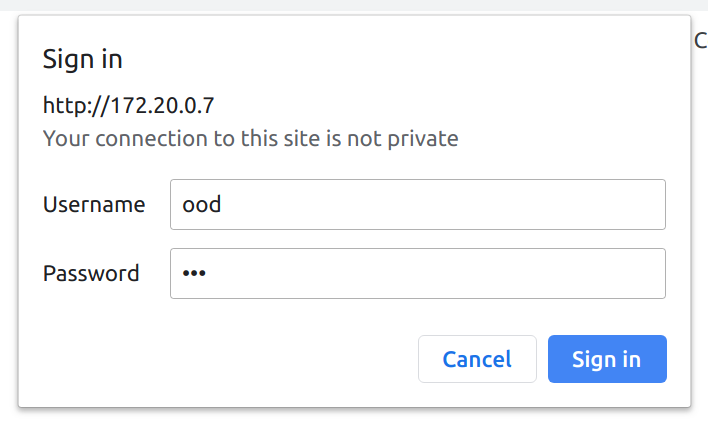
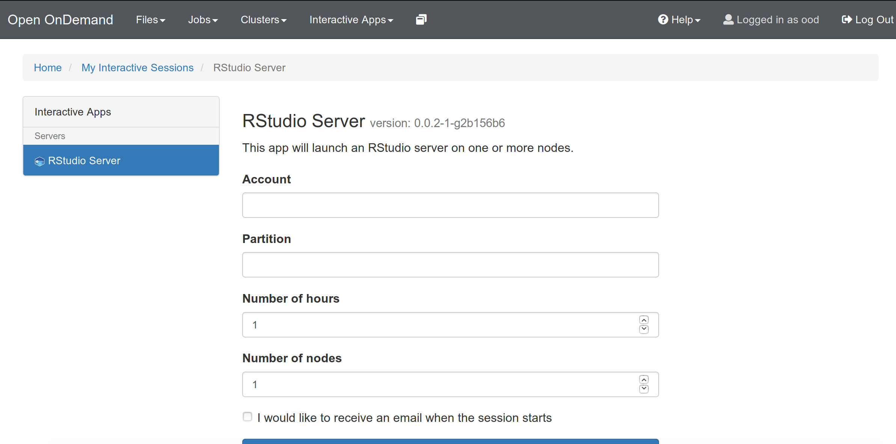

# Open On Demand Compose

This is an Open On Demand (OOD) instance installed with SLURM using docker-compose.
We use docker-compose to bring up a master node, worker nodes, and we store
data and log files in a mounted volume. The slurm configuration was adopted
from [slurm-docker-cluster](https://github.com/giovtorres/slurm-docker-cluster)
combined with [ood-vagrant](https://github.com/OSC/ood-images-full/).


## Getting Started

The base image for slurm is built by the Dockerfile in this repository. It
serves slurm 18.08.6

```bash
$ docker build -t vanessa/slurm:18.08.6 .
```

Then we build the nodes, which have additional VNC libraries:

```bash
$ docker-compose build
```

Then start te cluster:

```bash
$ docker-compose up -d
```

Confirm that containers are running:

```bash
  Name                 Command               State             Ports           
-------------------------------------------------------------------------------
c1          /usr/local/bin/docker-entr ...   Up      6818/tcp                  
c2          /usr/local/bin/docker-entr ...   Up      6818/tcp                  
mysql       docker-entrypoint.sh mysqld      Up      3306/tcp, 33060/tcp       
ood         /usr/local/bin/docker-entr ...   Up      6817/tcp, 80/tcp, 8080/tcp
slurmctld   /usr/local/bin/docker-entr ...   Up      6817/tcp                  
slurmdbd    /usr/local/bin/docker-entr ...   Up      6819/tcp 
```

## OnDemand Interface

Currently, you can get the ip address for the on demand interface via the ood logs:

```bash
$ docker-compose logs ood
Attaching to ood
ood          | AH00558: httpd: Could not reliably determine the server's fully qualified domain name, using 172.19.0.7. Set the 'ServerName' directive globally to suppress this message
```

In the example above, we would go to `http://172.19.0.7` and see a login:




And then we would sign in to see the dashboard:


If you click on Jobs -> Active Jobs you will see the jobs interface.


At this point, we want to launch a job! Shell into the container with the controller (master node):

```bash
$ docker exec -it slurmctld bash
```

Test that basic slurm commands are working:

```bash
[root@slurmctld /]# sinfo
PARTITION AVAIL  TIMELIMIT  NODES  STATE NODELIST
normal*      up 5-00:00:00      2   idle c[1-2]
```

## Submitting Jobs

From the `slurm-docker-cluster`, the `slurm_jobdir` volume is mounted on each  
Slurm container as `/data`. Therefore, in order to see job output files while 
on the controller, we can change directory to `/data` in this same container:

```bash
$ cd /data
```

And then submit a simple job.

```bash
$ sbatch --wrap="sleep 100"
Submitted batch job 2
```

The result file will be in the present working directory (`/data`):

```bash
$ ls
slurm-2.out
```

But more importantly, if you go to the onDemand interface, if you make sure that
the "All Jobs" is selected (and not "Your Jobs") you should see a job running,
via user root (the user you are in the Docker Container):


And when it completes, it will turn green.


## Interactive Apps

The documentation said that I could add add apps to [ood-home/ondemand/dev](ood-home/ondemand/dev)
and they would be available at `https://<hostname>/pun/dev/<app_directory>`. I tried
this, and it didn't work. Notably, the user in the browser is ood, and
so logically ood's home should work. Instead, I created an "apps" folder
and then cloned the Rstudio app there. It's bound to the container
via Docker Compose, so it shows up in the interface, and seems usable:



I also added the commands to install dependencies in the [Dockerfile.node](Dockerfile.node)

**IMPORTANT** I think that this should be done with instances. I shouldn't need
to be running any R/Rstudio servers directly.

```bash
# Install for Rstudio App
COPY apps/RStudio/install-compute-dependencies.sh /install-rstudio.sh
RUN /bin/bash /install-rstudio.sh
```

It doesn't actually launch a job, so I'll need to look into how this actually
works. I didn't install it as I should have, I just cloned the repository
directly there.

## Cleaning Up

If you need to stop and start the cluster, you can do this:

```bash
$ docker-compose stop
$ docker-compose start
```

or restart:

```bash
$ docker-compose restart
```

or bring down:

```bash
$ docker-compose down
```

When you want to delete the containers and really clean up:

```console
$ docker-compose stop
$ docker-compose rm -f
$ docker volume rm slurm-docker-cluster_etc_munge slurm-docker-cluster_etc_slurm slurm-docker-cluster_slurm_jobdir slurm-docker-cluster_var_lib_mysql slurm-docker-cluster_var_log_slurm
```

And then open to that address to log in with `ood` and `ood` to see the interface.
I need to update the hostname for the container so you don't need to do this.
